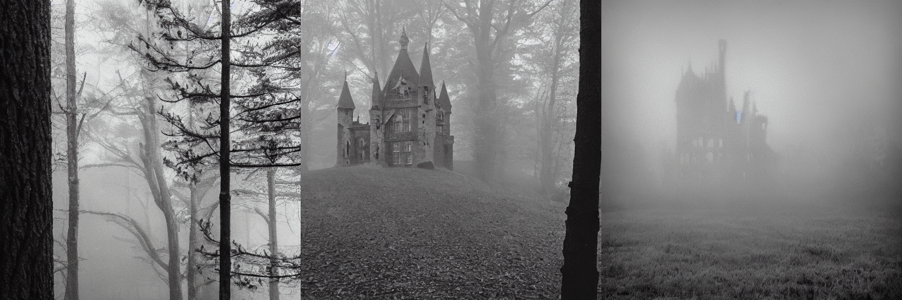

# Composable Diffusion 
## We propose to use conjunction and negation operator for compositional generation for all conditioned diffusion models!

### [Project Page](https://energy-based-model.github.io/Compositional-Visual-Generation-with-Composable-Diffusion-Models/) | [Paper](https://arxiv.org/pdf/2206.01714.pdf) | [Google Colab][composable-demo] | [Huggingface][huggingface-demo]
[![][colab]][composable-demo] [![][huggingface]][huggingface-demo]

**<p>Prompt:** *"A photo of Obama <span style="color:#EE4B2B">AND</span> a photo of Biden"</p>*


**<p>Prompt:** *"A castle in a forest <span style="color:#EE4B2B">AND</span> grainy, fog"</p>*


**<p>Prompt:** *"A castle in a forest <span style="color:#EE4B2B">NOT</span> grainy, fog"</p>*


1. Samples generated by [Stable-Diffusion](https://github.com/CompVis/stable-diffusion) using our compositional generation operator.
2. Prompts are from: [stable-diffusion-webui](https://github.com/AUTOMATIC1111/stable-diffusion-webui/wiki/Negative-prompt) and [Another Implementation of our method](https://github.com/Slickytail/stable-diffusion-compositional)


This is the official codebase for **Compositional Visual Generation with Composable Diffusion Models**.

[Compositional Visual Generation with Composable Diffusion Models](https://energy-based-model.github.io/Compositional-Visual-Generation-with-Composable-Diffusion-Models/)
    <br>
    [Nan Liu](https://nanliu.io) <sup>1*</sup>,
    [Shuang Li](https://people.csail.mit.edu/lishuang) <sup>2*</sup>,
    [Yilun Du](https://yilundu.github.io) <sup>2*</sup>,
    [Antonio Torralba](https://groups.csail.mit.edu/vision/torralbalab/) <sup>2</sup>,
    [Joshua B. Tenenbaum](https://mitibmwatsonailab.mit.edu/people/joshua-tenenbaum/) <sup>2</sup>
    <br>
    <sup>*</sup> Equal Contributation
    <br>
    <sup>1</sup>UIUC, <sup>2</sup>MIT CSAIL
    <br>
    [ECCV 2022](https://arxiv.org/pdf/2206.01714.pdf)

[colab]: <https://colab.research.google.com/assets/colab-badge.svg>
[huggingface]: <https://img.shields.io/badge/%F0%9F%A4%97%20Hugging%20Face-Spaces-blue>
[composable-demo]: <https://colab.research.google.com/github/energy-based-model/Compositional-Visual-Generation-with-Composable-Diffusion-Models-PyTorch/blob/main/notebooks/demo.ipynb>
[huggingface-demo]: <https://huggingface.co/spaces/Shuang59/Composable-Diffusion>

## **News**

--------------------------------------------------------------------------------------------------------
* Now you can try to use compose **[Stable-Diffusion](https://github.com/CompVis/stable-diffusion)** Model using our [![][huggingface]][huggingface-demo] or [![][colab]][composable-demo] to sample 512x512 images.
--------------------------------------------------------------------------------------------------------
* The codebase is built upon [GLIDE](https://github.com/openai/glide-text2im) and [Improved-Diffusion](https://github.com/openai/improved-diffusion).
* This codebase provides both training and inference code.
* **The codebase can be used to train text-conditioned diffusion model in a similar manner as [GLIDE](https://github.com/openai/glide-text2im).**

--------------------------------------------------------------------------------------------------------

## Setup

Run following to create a conda environment, and activate it:
```
conda create -n compose_diff python=3.8
conda activate compose_diff
```
To install this package, clone this repository and then run:

```
pip install -e .
```
--------------------------------------------------------------------------------------------------------
## Inference

### Google Colab 
The [demo](notebooks/demo.ipynb) [![][colab]][composable-demo] notebook shows how to compose natural language descriptions, and CLEVR objects for image generation.

### Python
Compose natural language descriptions using [Stable-Diffusion](https://github.com/CompVis/stable-diffusion):
```
# Conjunction (AND) by specifying positive weights
python scripts/image_sample_compose_stable_diffusion.py --prompt "a photo of Obama | a photo of Biden" --weights "1 | 1" --scale 7.5 --steps 50
```
```
# NEGATION (NOT) by specifying negative weights
python scripts/image_sample_compose_stable_diffusion.py --prompt "a castle in a forest | grainy, fog" --weights "1 | -1" --scale 7.5 --steps 50
```

Compose natural language descriptions using pretrained [GLIDE](https://github.com/openai/glide-text2im):
```
python scripts/image_sample_compose_glide.py --prompt "a camel | a forest" --scale 10 --steps 100
```

Compose objects:
```
MODEL_FLAGS="--image_size 128 --num_channels 192 --num_res_blocks 2 --learn_sigma False --use_scale_shift_norm False --num_classes 2 --dataset clevr_pos --raw_unet True"
DIFFUSION_FLAGS="--diffusion_steps 1000 --noise_schedule squaredcos_cap_v2 --rescale_learned_sigmas False --rescale_timesteps False"
python scripts/image_sample_compose_clevr_pos.py $MODEL_FLAGS $DIFFUSION_FLAGS --ckpt_path $YOUR_CHECKPOINT_PATH
```

Compose objects relational descriptions:
```
MODEL_FLAGS="--image_size 128 --num_channels 192 --num_res_blocks 2 --learn_sigma True --use_scale_shift_norm False --num_classes 4,3,9,3,3,7 --raw_unet True"
DIFFUSION_FLAGS="--diffusion_steps 1000 --noise_schedule squaredcos_cap_v2 --rescale_learned_sigmas False --rescale_timesteps False"
python scripts/image_sample_compose_clevr_rel.py $MODEL_FLAGS $DIFFUSION_FLAGS --ckpt_path $YOUR_CHECKPOINT_PATH
```

--------------------------------------------------------------------------------------------------------

## Training
* We follow the same manner as  [Improved-Diffusion](https://github.com/openai/improved-diffusion) for training.

To train a model on **CLEVR Objects**, we need to decide some hyperparameters as follows:
```
MODEL_FLAGS="--image_size 128 --num_channels 192 --num_res_blocks 2 --learn_sigma True --use_scale_shift_norm False --num_classes 2  --raw_unet True"
DIFFUSION_FLAGS="--diffusion_steps 1000 --noise_schedule squaredcos_cap_v2 --rescale_learned_sigmas False --rescale_timesteps False"
TRAIN_FLAGS="--lr 1e-5 --batch_size 16 --use_kl False --schedule_sampler loss-second-moment --microbatch -1"
```
Then, we run training script as such:
```
python scripts/image_train.py --data_dir ./dataset/ --dataset clevr_pos $MODEL_FLAGS $DIFFUSION_FLAGS $TRAIN_FLAG
```

Similarly, we use following commands to train a model on **CLEVR Relations**:
```
MODEL_FLAGS="--image_size 128 --num_channels 192 --num_res_blocks 2 --learn_sigma True --use_scale_shift_norm False --num_classes 4,3,9,3,3,7 --raw_unet True"
DIFFUSION_FLAGS="--diffusion_steps 1000 --noise_schedule squaredcos_cap_v2 --rescale_learned_sigmas False --rescale_timesteps False"
TRAIN_FLAGS="--lr 1e-5 --batch_size 16 --use_kl False --schedule_sampler loss-second-moment --microbatch -1"
python scripts/image_train.py --data_dir ./dataset/ --dataset clevr_rel $MODEL_FLAGS $DIFFUSION_FLAGS $TRAIN_FLAGS
```

To train a text-conditioned GLIDE model, we also provide code for training on **MS-COCO** dataset. \
Firstly, specify the image root directory path and corresponding json file for captions
in [image_dataset](https://github.com/energy-based-model/Compositional-Visual-Generation-with-Composable-Diffusion-Models-PyTorch/blob/main/composable_diffusion/image_datasets.py) file.\
Then, we can use following command example to train a model on MS-COCO captions:
```
MODEL_FLAGS="--image_size 128 --num_channels 192 --num_res_blocks 2 --learn_sigma True --use_scale_shift_norm False"
DIFFUSION_FLAGS="--diffusion_steps 1000 --noise_schedule squaredcos_cap_v2 --rescale_learned_sigmas False --rescale_timesteps False"
TRAIN_FLAGS="--lr 1e-5 --batch_size 16 --use_kl False --schedule_sampler loss-second-moment --microbatch -1"
python scripts/image_train.py --data_dir ./dataset/ --dataset coco $MODEL_FLAGS $DIFFUSION_FLAGS $TRAIN_FLAGS
```

--------------------------------------------------------------------------------------------------------

## Dataset
Training datasets for both **CLEVR Objects** and **CLEVR Relations** will be downloaded automatically
when running the script above.

If you need to manually download, the datasets used for training our models can be found at:

| Dataset | Link | 
| :---: | :---: | 
| CLEVR Objects | https://www.dropbox.com/s/5zj9ci24ofo949l/clevr_pos_data_128_30000.npz?dl=0
| CLEVR Relations | https://www.dropbox.com/s/urd3zgimz72aofo/clevr_training_data_128.npz?dl=0
--------------------------------------------------------------------------------------------------------

## Citing our Paper

If you find our code useful for your research, please consider citing 

``` 
@article{liu2022compositional,
  title={Compositional Visual Generation with Composable Diffusion Models},
  author={Liu, Nan and Li, Shuang and Du, Yilun and Torralba, Antonio and Tenenbaum, Joshua B},
  journal={arXiv preprint arXiv:2206.01714},
  year={2022}
}
```
